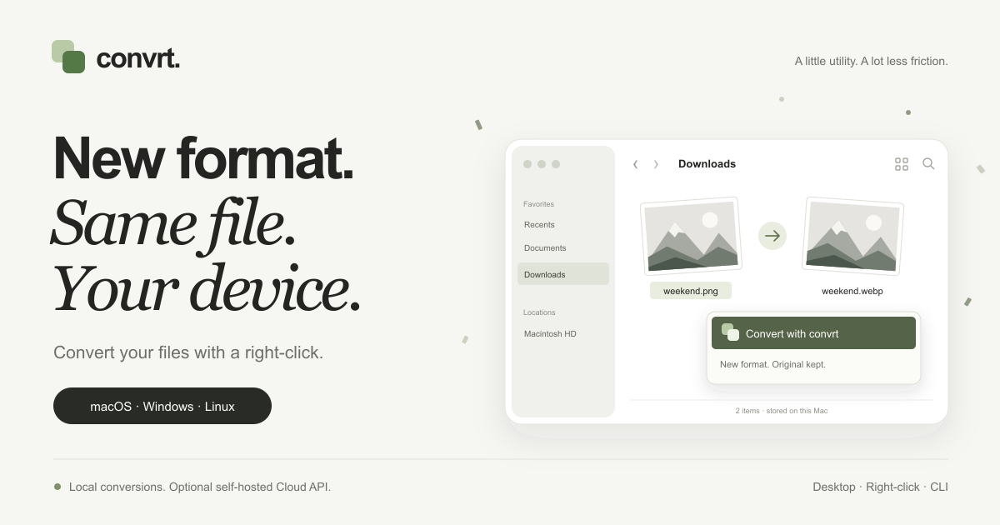

#  convrt



[](https://github.com/smeltery/convrt/actions/workflows/ci.yml)
[](LICENSE)
[](https://bun.sh/)
[](https://www.typescriptlang.org/)
[](docs/desktop/)
[](.pre-commit-config.yaml)
[](https://flox.dev)

Convert files from your desktop, file manager, terminal, or application.
Desktop and CLI conversions stay on-device. The separate Cloud API converts
files you explicitly upload to your configured server.

- Images, video, audio, PDF, and optional Office document conversions
- Desktop app with drag-and-drop, batch selection, presets, and output controls
- Finder format picker, Windows Explorer menu, and Linux file-manager actions
- Recursive CLI batches, bounded parallel jobs, and safe output publication
- Engine discovery and conversion routes of up to three steps
- Authenticated Cloud API and TypeScript SDK using the same conversion core

## Install

From a checkout, install [Bun](https://bun.sh/) 1.3 or use Flox:

```sh
flox activate
bun install --frozen-lockfile
bun run --filter @convrt/desktop dev
```

For the CLI, prefix commands below with `bun run apps/cli/src/cli.ts`, or
build the standalone distribution with `bun run --filter @convrt/desktop build`.
Keep the entire `apps/desktop/dist` directory together: it contains the Bun
runtime, CLI launcher, worker, and native image dependencies.

Desktop installers can be built on their target platform. Signed downloads
are not published yet. See [desktop setup](docs/desktop/README.md) and
[CLI setup](docs/getting-started/README.md).

## Usage

```sh
convrt photo.png --to webp
convrt photos/ --to webp --recursive --jobs 4 --out-dir converted/
convrt report.pdf --to png --pages 1,3-5 --dpi 150
convrt clip.mov --preset video --mute
```

Output goes beside the original unless `--out` or `--out-dir` is set.
Existing outputs are protected; use `--overwrite` to replace one explicitly.
Directory batches preserve relative paths and report partial failures.

## Engines

| Engine | Purpose |
| --- | --- |
| sharp | Image conversion, SVG rendering, resize and quality |
| FFmpeg | Video, audio, first-frame extraction, additional image codecs |
| Poppler + PDF writer | Selected PDF pages to images; images to PDF |
| LibreOffice | Optional Word, Excel, PowerPoint and open document formats |
| macOS sips | HEIC/HEIF input decoding on macOS |

Flox supplies FFmpeg and Poppler. Install LibreOffice separately for Office
conversion; no engine silently downloads software. Actual codec support
depends on the installed build. See [formats and verification](docs/formats/README.md).

## CLI

```sh
convrt engines
convrt targets photo.heic --menu
convrt formats
convrt presets
convrt --help
```

Options include quality, width/height, page selection, DPI, frame rate,
start/duration, audio removal, presets, recursive directories, and job count.

## Cloud API

The self-hosted API accepts authenticated multipart uploads, creates bounded
conversion jobs, and serves results through authenticated downloads. Files
expire after one hour by default. Each API key can access only its own jobs.

```ts
import { Convrt } from '@convrt/sdk'

const client = new Convrt({
  baseUrl: 'https://your-conversion-server.example',
  apiKey: process.env.CONVRT_API_KEY!,
})
const output = await client.convert(
  new File([bytes], 'photo.png'),
  'webp',
  { quality: 80 },
)
```

This explicitly uploads the file. Keep API keys on a trusted server.
The SDK is a workspace package, not yet published to npm. No hosted service,
accounts, billing, or subscription plans are offered by this repository.
See [API setup, limits, and deployment](docs/api/README.md).

## Documentation

- [Getting started](docs/getting-started/README.md)
- [Desktop and platform integrations](docs/desktop/README.md)
- [Finder Quick Action](docs/macos/README.md)
- [Formats](docs/formats/README.md)
- [Cloud API](docs/api/README.md)
- [Architecture](docs/architecture/README.md)
- [Operations and CI](docs/operations/README.md)
- [Contributor instructions](AGENTS.md)

## Development

```sh
bun run ci
bun run --filter @convrt/web dev
```

The website remains a marketing site; its interactive conversion illustration
does not process files.

## License

[PolyForm Shield 1.0.0](LICENSE).
