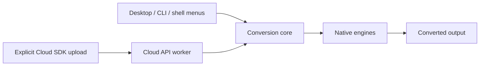

# Documentation

convrt provides local desktop, CLI, and file-manager conversion, plus a separate
opt-in Cloud API. All encoding and decoding lives in `@convrt/core`.

## Guides

| Guide | Audience |
| --- | --- |
| [Getting started](getting-started/README.md) | New users and contributors |
| [Desktop and shell integration](desktop/README.md) | macOS, Windows, Linux users |
| [Formats](formats/README.md) | Formats, routes, and controls |
| [macOS Quick Action](macos/README.md) | Finder integration |
| [Cloud API](api/README.md) | Developers and service operators |
| [Architecture](architecture/README.md) | Package boundaries |
| [Operations](operations/README.md) | CI, Flox, pre-commit, releases |

## Product invariants

1. Desktop, CLI, and shell-menu conversion stays on-device.
2. Cloud conversion only receives files explicitly uploaded by its clients.
3. File contents, paths, sizes, and previews are not sent to analytics or logs.
4. Output publication protects existing files unless replacement is requested.
5. Website and documentation distinguish implemented functionality from release readiness.
