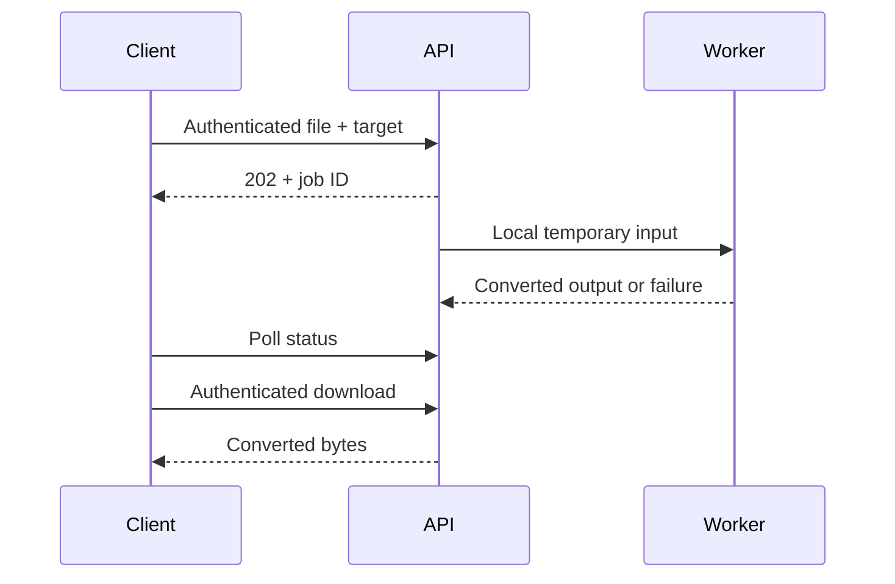

# Cloud API

Cloud conversion is opt-in: clients upload bytes to the configured API server.
The desktop app, CLI, Finder, and shell integrations do not call this service.

## Run

Set `CONVRT_API_KEYS` to one or more comma-separated random secrets, each at
least 32 characters, using your environment or secret manager. Do not commit
keys. Each key defines an independent job owner.

```sh
bun run --filter @convrt/api dev
```

The server binds to `127.0.0.1:8787`. Set `HOST` and `PORT` for your deployment.
Use TLS at a reverse proxy for remote clients. The SDK rejects remote HTTP.

## Endpoints

All `/v1` routes require `Authorization: Bearer <key>`.

| Method | Endpoint | Result |
| --- | --- | --- |
| GET | `/health` | Liveness; no authentication |
| GET | `/v1/formats` | Format catalog; engines depend on the server |
| POST | `/v1/jobs` | Upload and queue a conversion; HTTP 202 |
| GET | `/v1/jobs/:id` | Job status and expiration |
| GET | `/v1/jobs/:id/download` | Authenticated output download |
| DELETE | `/v1/jobs/:id` | Delete a completed or queued job and files |

Upload multipart fields: `file` (binary), `to` (format), and optional `options`
(JSON). Controls: `quality`, `width`, `height`, `page`, `dpi`, `fps`, `start`,
`duration`, `mute`. Paths and arbitrary engine arguments are rejected.

```sh
curl -H "Authorization: Bearer $CONVRT_API_KEY" \
  -F file=@photo.png -F to=webp \
  -F 'options={"quality":80}' \
  http://127.0.0.1:8787/v1/jobs
```

Statuses are `queued`, `running`, `succeeded`, and `failed`. Successful jobs
include a relative `downloadUrl`. Errors use `{ "error": "..." }` with HTTP
400, 401, 404, 409, 413, 415, 422, 429, or 500. Engine diagnostics and original
upload names are not returned or logged.

## Limits and lifecycle

- 25 MiB total multipart request size; four simultaneous uploads
- Two conversion workers; at most 100 retained jobs
- Two-minute conversion timeout
- One-hour result retention, with cleanup every minute
- Job ownership checked on status, download, and deletion
- Running jobs cannot be deleted; retry after completion



## Deployment boundary

Set `CONVRT_DATA_DIR` to enable a SQLite job journal and persistent file storage.
Completed results and queued jobs survive restarts. Interrupted workers become
failed jobs with `conversion_interrupted`; clients can submit them again.
Expired files and uploads orphaned by a crash are cleaned up. Use one API
instance per data directory and retain the same API keys across restarts.
Without this setting, jobs use ephemeral storage and disappear on shutdown.

A [Docker Compose setup](../../deploy/api/README.md) provides persistent storage,
a non-root conversion service, memory/CPU limits, a read-only root filesystem,
and an internal network behind a local gateway. It is intended for one trusted
operator. A container shared by all jobs does not isolate one customer’s native
codec process from another customer’s files. Public multi-tenant deployment
still needs per-job isolation, quotas, TLS, and managed key rotation.
Keep request-body and file metadata logging disabled at the proxy.

Build a worker distribution with `bun run --filter @convrt/api build`; set
`CONVRT_API_WORKER` to its launcher or the absolute worker `.js` path to use it
(use the `.js` path on Windows). Keep its Bun runtime and native
modules together. Source mode uses the current Bun executable automatically.

## TypeScript SDK

`packages/sdk` provides `createJob`, `getJob`, `download`, `deleteJob`, and
`convert`. `convert` polls until completion and returns a Blob. Its optional
fourth argument accepts `signal` and `timeoutMs`; cancellation stops the client
request, not an already-running server conversion. Outputs remain until deleted
or expired. The SDK never follows redirects carrying credentials.
