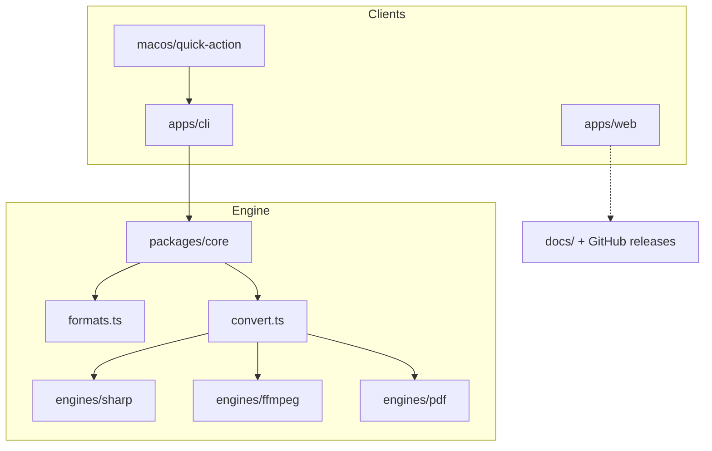

# Architecture

## Boundaries

| Package | Owns | Does not own |
| --- | --- | --- |
| `@convrt/core` | Format table, engines, errors | CLI flags, UI, distribution |
| `@convrt/cli` | argv parsing, human output | Encode details |
| `@convrt/web` | Marketing site | Conversion runtime |
| `macos/quick-action` | Finder service install | Engines |

## Failure model

`ConvertError` covers missing files, unknown formats, unsupported pairs, missing
system engines, and invalid quality. The CLI prints `convrt: <message>` and
exits `1`. Failed ffmpeg runs remove partial outputs. Image encodes buffer then
write once.
