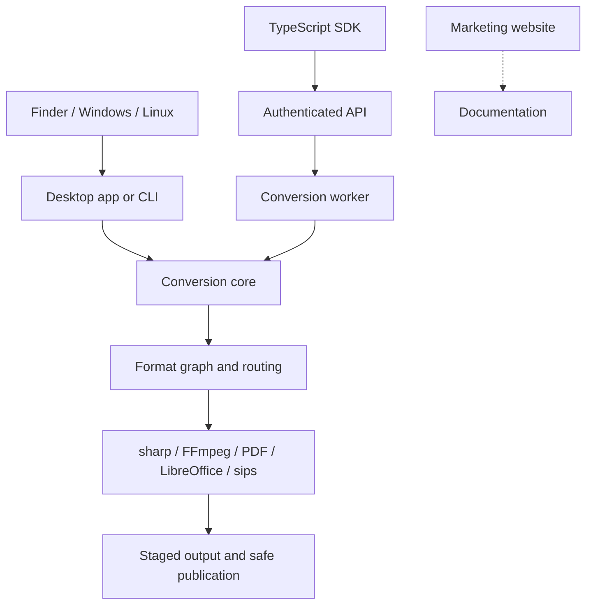

# Architecture

## Boundaries

| Package | Responsibility |
| --- | --- |
| `@convrt/core` | Formats, discovery, routing, engines, batch execution |
| `@convrt/cli` | argv and human-readable output |
| `@convrt/desktop` | Sandboxed Electron UI and Bun worker transport |
| `@convrt/api` | Authentication, bounded uploads, job lifecycle, worker processes |
| `@convrt/sdk` | Explicit remote upload and polling client |
| `@convrt/web` | Marketing only; no actual conversion |
| `macos/quick-action`, `integrations` | File-manager entry points |

## Failure model

Conversion validates controls and input, finds an available route, and writes
each intermediate file into a private temporary directory. Publication is
exclusive unless overwrite is explicitly requested. Temporary files are removed
on handled success and failure. Original input paths are never valid outputs.

Batch jobs report per-input failures and preserve successful outputs. The CLI
returns exit code 1 if any input failed. Server workers return generic failures;
engine stderr, original upload names, and filesystem paths are not exposed.

## Deployment model

The desktop bundles Bun and native image dependencies; external tools remain
optional system installations. API workers run separately from HTTP handling.
Process separation is not a security sandbox; see the [API deployment
boundary](../api/README.md) before accepting public uploads.
