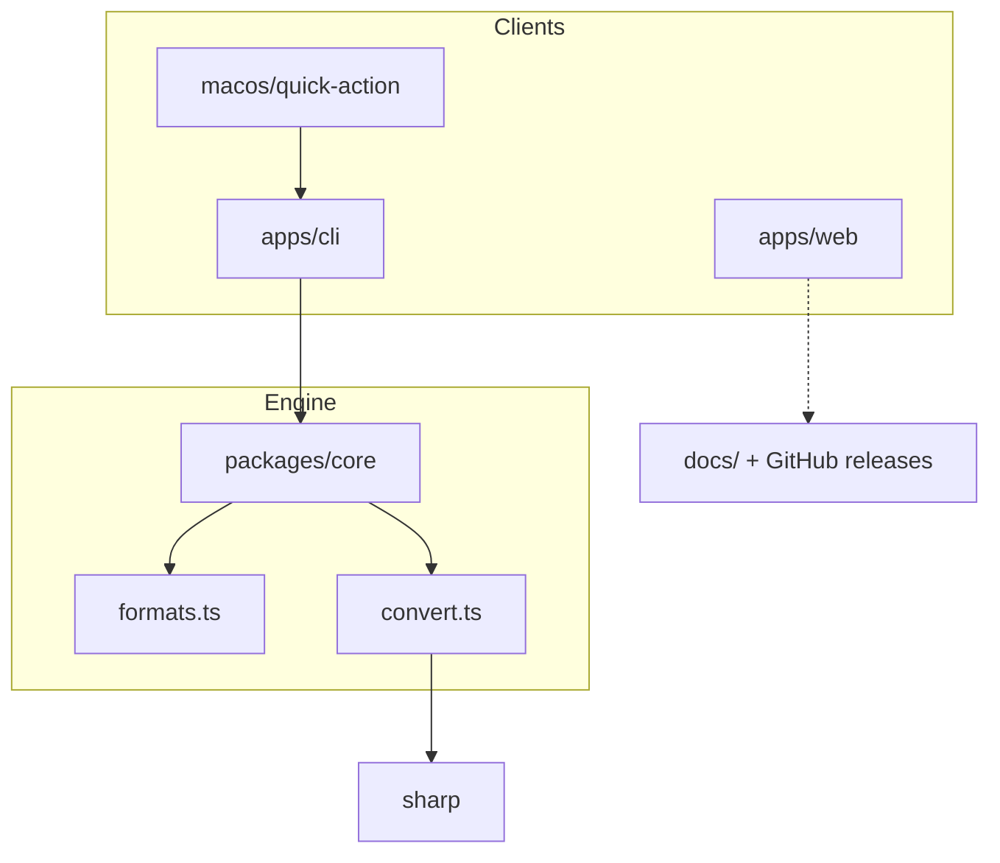

# Architecture

## Boundaries

| Package | Owns | Does not own |
| --- | --- | --- |
| `@convrt/core` | Format table, conversion, errors | CLI flags, UI, distribution |
| `@convrt/cli` | argv parsing, human output | Encode details |
| `@convrt/web` | Marketing site | Conversion runtime |
| `macos/quick-action` | Finder service install | Engines |

## Failure model

`ConvertError` covers missing files, unknown formats, decode-only targets, and
invalid quality. The CLI prints `convrt: <message>` and exits `1`. Partial
outputs are not left behind on encode failure because `Bun.write` runs only
after a full buffer is produced.
