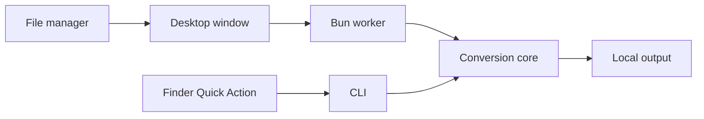

# Desktop and shell integrations

The Electron desktop app uses a sandboxed renderer and a separate Bun worker.
All conversion code stays in `@convrt/core`. The window supports file selection,
drag-and-drop, file/folder batches, recursive discovery, common targets, presets,
image sizing, PDF pages, media trimming, frame rate, audio removal, parallel jobs,
output folders, and batch results. Existing outputs are protected unless the
replacement checkbox is selected. It never connects to the Cloud API.

## Development and packaging

```sh
bun install --frozen-lockfile
bun run --filter @convrt/desktop dev
bun run --filter @convrt/desktop package
```

Build on the destination OS/architecture so Bun and sharp native binaries
match. Packaging produces a macOS DMG, Windows NSIS installer, or Linux
AppImage/DEB in `apps/desktop/release`. Signing and notarization require your own
release credentials; source builds are not signed public releases.

The packaged app includes Bun, the CLI launcher, conversion worker, and sharp.
FFmpeg, Poppler, and LibreOffice are optional system installations. Run
`convrt engines` to see availability. GUI launches on macOS may need system
tools in `/opt/homebrew/bin` or `/usr/local/bin`.

## macOS

Use the [Finder Quick Action](../macos/README.md). It accepts multiple selected
files and displays a target picker derived from the first file. Incompatible
files in a mixed selection report conversion failures without replacing originals.

## Windows

After installing or unpacking the desktop app, run PowerShell:

```powershell
./integrations/windows/install.ps1 -Executable 'C:\path\to\convrt.exe'
```

The per-user Explorer menu requires no administrator rights. On Windows 11,
it appears under **Show more options**. Multiple launches are forwarded to the
same desktop instance. Remove the entry with `uninstall.ps1` in that directory.

## Linux

```sh
chmod +x /path/to/convrt.AppImage
bash integrations/linux/install.sh /absolute/path/to/convrt.AppImage
```

This installs a desktop **Open With** entry and a Nautilus **Scripts** action.
Other file managers may use the desktop entry; dedicated Dolphin/Thunar plugins
are not included. Remove entries with `bash integrations/linux/uninstall.sh`.



## Verification

Core conversions and API behavior are tested separately from platform UI.
The macOS app was packaged and tested through its renderer, IPC bridge, bundled
worker, and real PNG-to-WebP conversion. Windows/Linux installer and context-menu behavior requires native
platform QA; configuration alone is not proof of a successful packaged release.

The `desktop` workflow builds native macOS, Windows, and Linux packages and tests
their bundled workers from a temporary directory outside the checkout. It also
checks Windows registry and Linux launcher installation/removal. Run the same
worker test locally with `bun apps/desktop/scripts/smoke.ts` after packaging.
