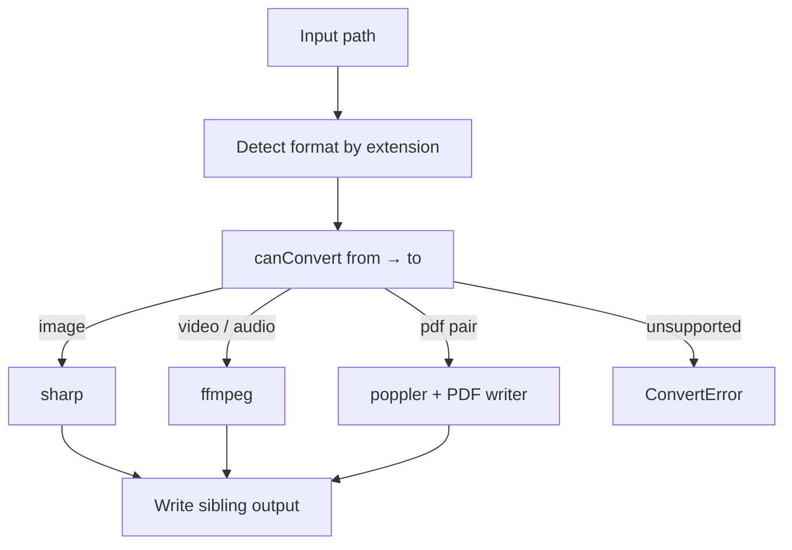

# Formats

Conversion stays offline. Engines are selected by format family:

| Family | Engine | Role |
| --- | --- | --- |
| Image | [sharp](https://sharp.pixelplumbing.com/) (libvips) | Decode/encode stills |
| Video / audio | [ffmpeg](https://ffmpeg.org/) | Remux/transcode AV |
| PDF | [poppler](https://poppler.freedesktop.org/) `pdftoppm` + JPEG-in-PDF | First page ↔ image |

## Ready now

| Format | Family | Decode | Encode |
| --- | --- | --- | --- |
| HEIC / HEIF | image | yes | no |
| PNG, JPEG/JPG, WebP, AVIF, TIFF, GIF | image | yes | yes |
| MP4, MOV, WebM, MKV | video | yes | yes |
| MP3, AAC, M4A, WAV, FLAC, OGG | audio | yes | yes |
| PDF | document | yes (→ image) | yes (← image) |

Cross-family rules (see `canConvert`):

- same family ↔ same family (when encode is allowed)
- video → audio or image (first frame)
- image ↔ PDF
- PDF → image (page 1)

Install `ffmpeg` and `poppler` (`pdftoppm`) for AV and PDF paths. Flox ships both.
