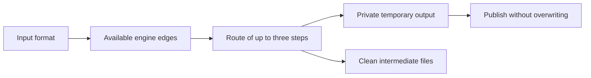

# Formats

Local clients never upload conversion inputs. The explicit Cloud API uses the
same engine adapters on its server. Formats below describe implemented routes;
installed codecs determine which routes work on a particular machine.

| Family | Formats | Engine |
| --- | --- | --- |
| Images | PNG, JPEG/JPG, WebP, AVIF, TIFF, GIF | sharp |
| Additional images | BMP, ICO, TGA, PPM, QOI, OpenEXR | FFmpeg |
| Input-only images | SVG; HEIC/HEIF | sharp; macOS sips or compatible sharp build |
| Video | MP4, MOV, WebM, MKV, AVI | FFmpeg |
| Audio | MP3, WAV, FLAC, AAC, M4A, OGG, Opus | FFmpeg |
| PDF | PDF ↔ image | Poppler renderer + PDF writer |
| Text documents | DOC, DOCX, ODT, RTF, TXT, HTML | Optional LibreOffice |
| Spreadsheets | XLS, XLSX, ODS, CSV | Optional LibreOffice |
| Presentations | PPT, PPTX, ODP | Optional LibreOffice |

## Routes and controls

`convrt targets file.ext` lists reachable formats with installed engines.
Routes use at most three steps. Office conversion stays within the relevant
document family or exports PDF. PDF can then render to images. Video can export
audio or its first frame. Image/PDF conversions process stills, not animation
sequences. HEIC/HEIF encode and SVG encode are not advertised.

PDF rendering defaults to page 1 at 150 DPI. Use `--pages 1,3-5` for one output
per page, with `-page-N` suffixes. Quality defaults to 82. Width/height fit images
inside the requested bounds without enlargement. Media accepts start, duration,
frame rate, and audio removal. ICO is limited to a 256-pixel box.

## Verification

Tests perform actual SVG and raster conversions, all listed additional image
round-trips, video/audio outputs, PDF rendering, and selected controls.
LibreOffice tests exercise text document outputs, spreadsheets, and slides when
that engine is installed; missing system engines are reported as skipped tests.
HEIC support depends on the operating system decoder and the input file’s codec.
The catalog is not a guarantee that every codec variant is decodable.

Flox supplies FFmpeg and Poppler. Install LibreOffice separately. Neither local
engines nor the API download document packs automatically.
