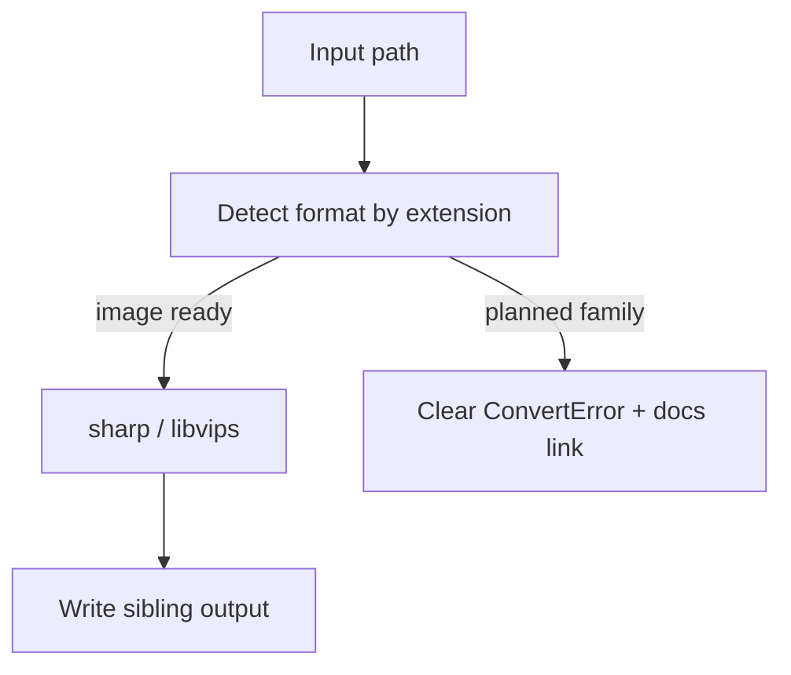

# Formats

Image conversion ships today via [sharp](https://sharp.pixelplumbing.com/)
(libvips). Video, audio, and PDF are planned and tracked here so the product
story stays honest.

## Ready now

| Format | Decode | Encode | Notes |
| --- | --- | --- | --- |
| HEIC / HEIF | yes | no | Common iPhone camera output |
| PNG | yes | yes | Lossless |
| JPEG / JPG | yes | yes | MozJPEG encode |
| WebP | yes | yes | Default Quick Action target |
| AVIF | yes | yes | Smaller, slower encode |
| TIFF | yes | yes | |
| GIF | yes | yes | First frame for animated input |

## Planned

| Family | Examples | Engine direction |
| --- | --- | --- |
| Video | mp4, mov, webm | ffmpeg |
| Audio | wav, flac, mp3, aac | ffmpeg |
| Document | pdf ↔ image | poppler / pdfium |

Request new pairs in GitHub Issues. Prefer pairs that stay fully offline.
