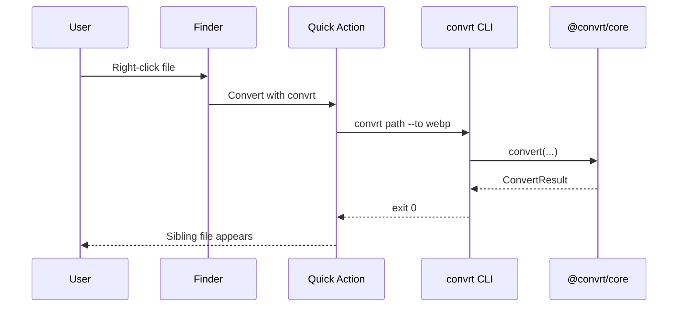

# macOS Quick Action

The whole product premise is a Finder right-click. The Automator service in
[`macos/quick-action`](../../macos/quick-action) wraps the CLI.



## Install

```sh
chmod +x macos/quick-action/install.sh
./macos/quick-action/install.sh
```

`convrt` must already be on your `PATH`, plus `ffmpeg` and `pdftoppm` for
AV/PDF conversions. Pass a target format as the first argument (default
`webp`); remaining args are selected file paths.

## Privacy

The service never shells out to a network endpoint. It only invokes the local
binary with the selected file paths.
