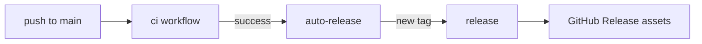

# Operations

## Flox

`.flox/env/manifest.toml` pins Bun, git, gh, pre-commit, and actionlint.
Activation installs dependencies and pre-commit hooks when needed.

```sh
flox activate
```

Local development runs through `flox activate`. Hygiene CI uses Flox for
actionlint/shellcheck. The quality job uses host Bun via `setup-bun` so sharp's
native bindings can load against the runner `libstdc++`.

## Pre-commit

`.pre-commit-config.yaml` mirrors CI gates: Biome format, lint, typecheck,
tests, markdownlint, mermaid parse, doc links, file budgets, actionlint, and
basic git hygiene.

```sh
pre-commit install
pre-commit run --all-files
```

## CI jobs

| Job | Purpose |
| --- | --- |
| `quality` | `bun run ci` through Flox on `ubuntu-latest` |
| `hygiene` | actionlint + shellcheck + `git diff --check` |

## Releases

Hab-style automation:

1. `ci` goes green on `main`.
2. `auto-release` cuts the next `vMAJOR.MINOR.PATCH` tag when HEAD is untagged.
3. `release` builds CLI + website artifacts and publishes a GitHub Release.


