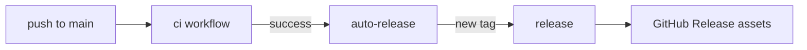

# Operations

## Flox

`.flox/env/manifest.toml` pins Bun, git, gh, pre-commit, and actionlint.
Activation installs dependencies and pre-commit hooks when needed.

```sh
flox activate
```

Local development runs through `flox activate`. Hygiene CI uses Flox for
actionlint/shellcheck. The quality job uses host Bun via `setup-bun` so sharp's
native bindings can load against the runner `libstdc++`.

## LOC budgets

`scripts/file-size-budgets.json` defaults to **200 lines** per tracked or unignored source
file. `scripts/flat-directory-budgets.json` defaults to **15** direct files per
directory. Exceptions need an explicit entry and reason.

## Pre-commit

`.pre-commit-config.yaml` mirrors CI gates: Biome format, lint, typecheck,
tests, markdownlint, mermaid parse, doc links, file budgets, actionlint, and
basic git hygiene.

```sh
pre-commit install
pre-commit run --all-files
```

## CI jobs

| Job | Purpose |
| --- | --- |
| `quality` | `bun run ci` with host Bun and system engines on `ubuntu-latest` |
| `hygiene` | actionlint + shellcheck + `git diff --check` |
| `desktop` | Native packages, bundled conversion smoke tests, shell registration |
| `API container` | Container startup, HTTP conversion, persistent results after restart |

## Releases

Hab-style automation:

1. `ci` goes green on `main`.
2. `auto-release` cuts the next `vMAJOR.MINOR.PATCH` tag when HEAD is untagged.
3. `release` builds CLI + website artifacts and publishes a GitHub Release.

CLI archives target Linux x64, macOS arm64, and Windows x64. Each archive
contains the Bun runtime, launcher, and native image dependencies. Extract the
whole archive together. Desktop installers are built separately with
`bun run --filter @convrt/desktop package`; signing credentials are not bundled.


